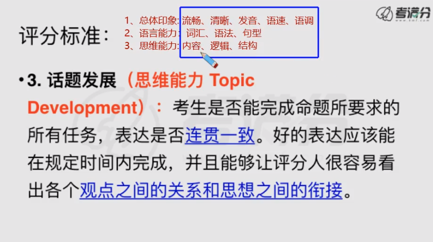
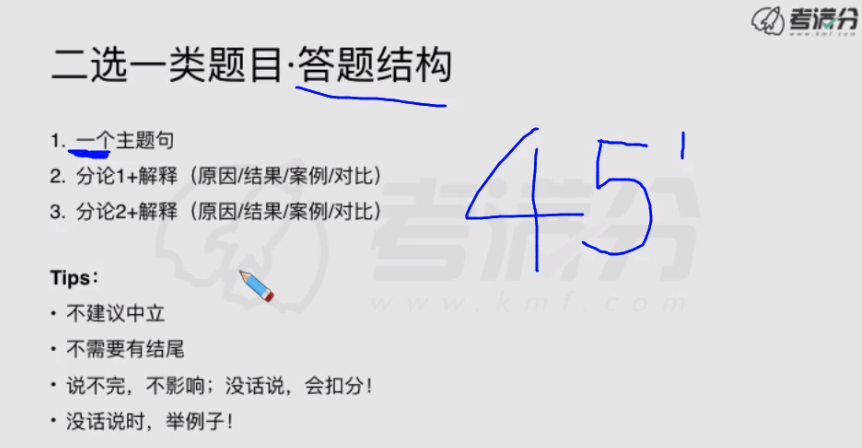

#  Day1直播

speech rater：机器判分

人+机器联合判分，人占比重更大

Fair = high-intermediate(20-24)

大Fair（23、24）

中Fair（21、22）

小Fair（19、20）

Good = advanced(25-30)

大陆均分：19

to qualify your drawbacks.

**流畅度**是Good的门槛。如何训练流畅？——计时训练

**清晰**——怎么样不吞音：说话大声、要使劲儿（保证说话的音量）

**发音**——正确->地道；以美式发音为主

**语速**——整体速度（我的语速=bobo语速）、节奏感：连读、失爆、弱读、重读、停顿

最先保证清晰度！！

**语调**的原则：句中用扬调或者平调、句末用降调

**语法**、**词汇**：准确地使用，用词多样性

**简单和复杂的语言结构**：复杂句$\neq$长难句，复杂句是：句中成分多，有更多的副词定状补；以简单句为主。

fall through, ride over......

副词&动介词组的积累：**<u>demo30跟读+背诵！</u>** 

15s之前：读题+题目关键词+确定自己立场

15s内：想结构

45s内：

主题句：确定立场，简化题干，替换关键词，变陈述句。

分论&解释：重要的是**解释**，而不是分论点的数量。

**逻辑关联词 **很重要！！！

Sample Task (2018.3.11): Some parents believe they should protect their
children so that they won't make mistakes, while other parents choose to let
their children make mistakes. Which opinion do you agree with?

# Day2 

 

# 独立题偏、难、怪题精讲（demo）：

# last broadcast：

